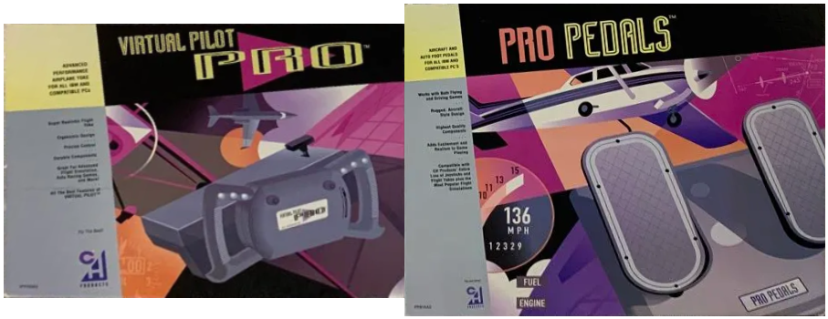
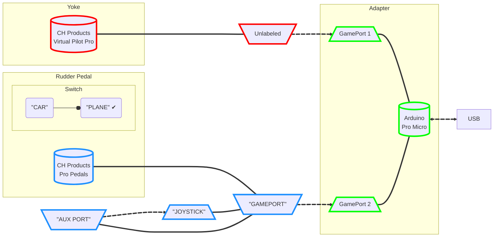

# Virtual Pilot Pro & Pro Pedals USB Adapter

This is a slight modification of [Necroware's GamePort Adapter](https://github.com/necroware/gameport-adapter). 
For technical information about how it works, please visit the original project page, it is very well documented.

Many people from the retro community still have their beloved joysticks and
gamepads from the early days. These devices often live their lives somewhere in
the dark corners of our basements and we don't dare to throw them away, because
of nostalgic reasons. They remind us so much of our childhoods, where we played
our Wing Commanders, X-Wings, Descents and many other games. These old joysticks
were all made to be connected to the game port, usually on a sound card. But
by the end of 90's and beginning of 2000's game ports vanished from our
computers and were replaced by USB and our old joysticks disappeared into the
past. Today not everybody has a full retro PC and many people are using their
modern computer with  DOSBox to play the old games, sometimes with a modern
USB joystick. But wouldn't it be great to play the old games with the same
joystick which we used back then? And this is where this adapter comes into play.

It can be used to connect the **CH Products Virtual Pilot Pro** (yoke) and/or the **CH Products Pro Pedals** (rudder pedal) to a USB port.

## What's different from [Necroware's GamePort Adapter](https://github.com/necroware/gameport-adapter)

1. There are two GamePort connectors instead of just one.
   * Why: I wanted to use only one adapter for both controllers, yoke and rudder pedal. 
   * Drawback: The DIP switch had to be removed to reuse the inputs. 
   You can still change to all other Joystick drivers by editing the code if you want 
   (but changes will be necessary to individually add pedal functionality to each driver).

3. Sliders:

   Reading an axis as a "slider" on your driver will skip calibrating it's center based on it's position during power-on. 
   The rest of the auto-calibration is still the same. 
   * Usefull for pedals that spring back instead of staying centered.

5. Driver for the CH Products Virtual Pilot Pro yoke:
   * CHVirtualPilotPro.h file provided for use with the unmodified [Necroware's GamePort Adapter](https://github.com/necroware/gameport-adapter).

6. Driver for the CH Producst Pro Pedals:
   * CHProPedals.h file provided for use with the unmodified [Necroware's GamePort Adapter](https://github.com/necroware/gameport-adapter).

## Connectors (ATENTION!)

DO NOT connect as stated on the user manual of CH Products Pro Pedals. 
The originl intended way of connecting it will not be recognized without modifications to the code.

CONNECT AS SUCH:

There is NO AUTOMATIC DETECTION of what controller is plugged to which port.
* The CH Products Virtual Pilot Pro MUST be plugged to the adapter's GamePort 1. 
   The CH Products Pro Pedals have a switch and thee 15 pin connectors, two male and one female:
* The mode switch on the pedals MUST be set to "PLANE" BEFORE powering on the adapter.
* The male end labeled "AUX PORT" MUST be plugged on the female end labeled "JOYSTICK"
* The male end labeled "GAMEPORT" MUST be plugged to the adapter's GamePort 2.

Connecting any connector or changing the switch position after powering on the adapter will mess up the calibration.

## Which controllers were tested?

* CH Products Virtual Pilot Pro
* CH Products Pro Pedals

## Bill of materials (BOM)

The hardware is super simple. To build an adapter you'll need the following parts:

Part    |  Qty  | [LCSC](https://lcsc.com/) #  | [Digikey](https://www.digikey.com/) #                | [Mouser Electronics](https://www.mouser.com/) # | Comment
--------|-------|---------|--------------------------|----------------------|------------------------------------------
CONN1   |   2   | C77835  | 609-5371-ND              | 523-L77SDA15SA4CH4F  | DB15 female connector
R1..R8  |   8   | C172965 | 13-MFR-25FTE52-100KCT-ND | 603-MFR-25FTE52-100K | 100 kOhm resistors
U1      |   1   | C72120  | ED3051-5-ND              | 649-DILB24P-223TLF   | DIP24 Socket (optional)
U1      |   1   |   N/A   | 1568-1060-ND             | 474-DEV-12640        | Arduino Pro Micro (ATmega32U4 16MHz, 5V), including two 12 pin header connectors, MicroUSB version (see "Known issues")

## How does it work?

The adapter is built around Arduino Pro Micro, which uses the same ATmega32U4
microcontroller as Leonardo. This microcontroller has built-in USB HID
capabilities and can be used to build HID input devices, like joysticks. The
adapter itself is super simple, the main brainwork was invested into the
software. Very much simplified, it reads the joystick states and sends the data,
via USB, to the computer, which thinks that it is communicating with a USB 
joystick.

## What is auto calibration?

Old analog joysticks have resistors inside, which are specified to be 100 kOhm.
Unfortunately, these resistors are either worn out, bad quality or were wrong from
the beginning. Therefore most of the generic analog joysticks had adjustment
screws to correct the center point of the joystick. Also many games had
calibration options in their settings to readjust the joystick. With USB and new
digital solutions the calibration was not required anymore and was completely
implemented in the joysticks and/or drivers. Many modern games have no option
to re-calibrate the joystick anymore. If we try to play such newer games with
an old analog joystick through this adapter, the joystick center point would be
totally offset. That's why the adapter implements auto calibration internally and
presents already corrected values to the operation system. 

__ATTENTION__: a hard requirement for using the analog joysticks is that during 
plugging into the USB port all axes not set up as sliders must be in their middle state, 
because all the subsequent calibration happens based on the initial state.

## Known issues

* *Ruder Axis is not working, just the Toe Brakes*

   A) First make sure all the connectors are as specified on this page, not as specified on the manual.

     - Virtual Pilot Pro's connector ➤ Adapter's GamePort 1 connector

     - Pro Pedals' connector labeled "GAMEPORT" ➤ Adapter's GamePort 2 connector

     - connector labeled "AUX PORT" ➤ connector labeled "JOYSTICK"
  
   B) Set the mode switch on the pedal to "PLANE" instead of "CAR". 
   
   Setting it to car mode sends Left and Right Pedals to the connector labeled "GAMEPORT" as axes 3 and 4. 
   This ignores the Rudder functionality completely, and we already have both Left Pedal and Right Pedal inputs as axes 1 and 2 being passed through from the connector labeled "AUX PORT". 
   Therefore, there is no use switching to car mode.

* *Rudder axis is weird*

   Changing the mode switch on the pedal (from "CAR" to "PLANE" or otherwise) will mess up the calibration. 
   Power off the adapter, make sure the switch is set to "PLANE" BEFORE the adapter is powered back on. 
   (Assuming your hardware is not damaged).

* *Yoke/Joystick *

   Changing the mode switch on the pedal (from "CAR" to "PLANE" or "PLANE" to "CAR") will mess up the calibration. 
   Unplug the adapter, make sure the switch is set to "PLANE" BEFORE plugging it back again. 

* *Some axes on an analog joystick are offset*

   Auto calibration requires those axes to be in the center position during 
   initialization. Please see the paragraph about auto-calibration.

* *Joystick doesn't work*

   Make sure that you are using one of supported joysticks or a joystick which can
   work in legacy analog mode

* *MicroUSB port on the Arduino is not stable enough*

   Use the USB-C version of the Arduino instead.  
   Or always keep the MicroUSB cable attached to the Arduino MicroUSB version to avoid further wear and apply plug/unplug operations only on the remote side of the cable.

## Special thanks

Obviously, huge thanks to [Necroware](https://github.com/necroware) for developing and sharing the project. 
And to those previously mentioned in the original project: 
"I would like to give some special thanks to *Creopard* from the German 
dosreloaded.de community for providing me the mentioned joysticks. Without that
donation this project wouldn't be possible. Especially dealing with Sidewinder
3D Pro was a very exciting task."

## Links
* [Linux Sidewinder Driver](https://github.com/torvalds/linux/blob/master/drivers/input/joystick/sidewinder.c)
* [Sidewinder patent](https://patents.google.com/patent/US5628686A/en)
* [Creopard Retro Site](https://www.creopard.de/)

